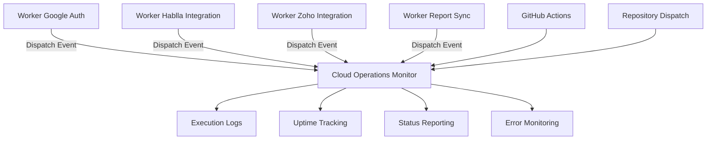
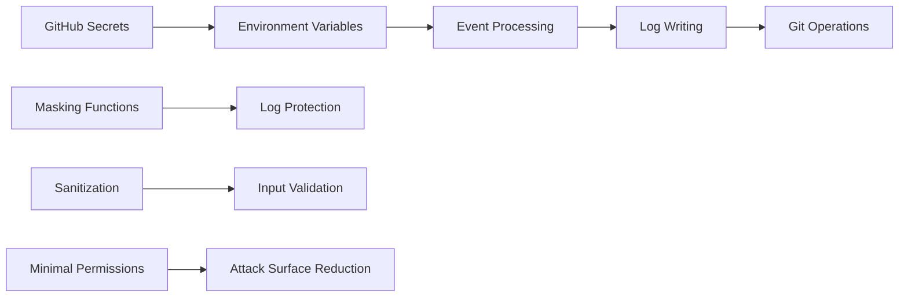
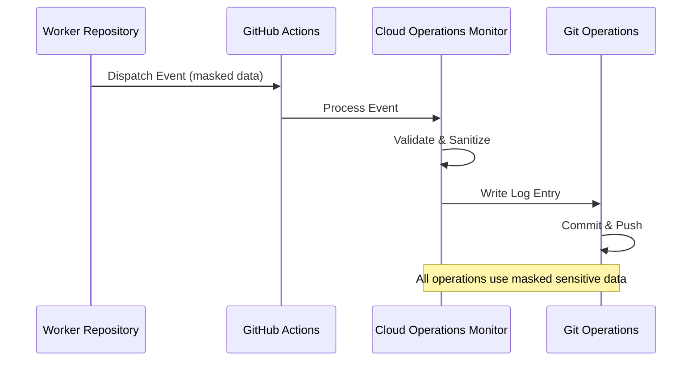

# Cloud Operations Monitor

## Overview

This repository serves as the central monitoring and logging hub for the entire automation ecosystem. It tracks the execution status, uptime, and operational health of all worker services in the system.

## System Architecture



## Purpose & Functionality

### Centralized Monitoring
This repository acts as the "Operations Center" for the entire automation ecosystem, providing:

- **Execution Tracking**: Records successful and failed executions of all worker services
- **Uptime Monitoring**: Maintains a historical log of system availability and performance
- **Status Reporting**: Provides real-time visibility into the health of the automation pipeline
- **Error Tracking**: Captures and logs system failures for troubleshooting and analysis

### Integration Points

The monitor integrates with all worker repositories through GitHub's `repository_dispatch` API:

1. **Worker Google Auth**: Logs authentication service execution status
2. **Worker Hablla Integration**: Tracks Hablla API synchronization operations
3. **Worker Zoho Integration**: Monitors Zoho Creator data synchronization
4. **Worker Report Sync**: Records custom report generation activities

## Technical Implementation

### Folder Structure
* **.github/workflows/log-handler.yml**: Main workflow that processes dispatch events and updates monitoring logs
* **daily_uptime.log**: Historical record of system operations and status
* **README.md**: Documentation and system overview

### Core Components

1. **Event Handler**: Processes `repository_dispatch` events from worker repositories
2. **Log Writer**: Securely writes execution status to the uptime log file
3. **Git Integration**: Commits and pushes log updates to maintain historical records
4. **Secure Processing**: Implements masking and sanitization for sensitive data

## Security Implementation

### Multi-Layer Security Architecture



### Security Features

- **Explicit Secret Masking**: All secrets are explicitly masked in GitHub Actions workflows using `::add-mask::`
- **Minimal Permissions**: Workflows use `contents: write` permissions only, reducing potential damage from compromised workflows
- **Secure Logging**: Custom masking ensures no sensitive data is exposed in logs
- **Input Validation**: All incoming data is validated and sanitized before processing
- **Environment Isolation**: All sensitive configuration stored in GitHub Secrets
- **Audit Trail**: Complete historical record of all system operations

## Data Flow Security



## Monitoring Capabilities

### Execution Tracking
- **Success/Failure Status**: Records the outcome of each worker execution
- **Timestamp Logging**: Maintains precise timing information for all operations
- **Worker Identification**: Tracks which specific worker service was executed
- **Error Details**: Captures error information (with sensitive data masked)

### Uptime Monitoring
- **Historical Records**: Maintains a comprehensive log of system availability
- **Trend Analysis**: Enables analysis of system performance over time
- **Availability Metrics**: Provides insights into system reliability
- **Performance Baselines**: Establishes benchmarks for system performance

### Status Reporting
- **Real-time Updates**: Immediate logging of system events
- **Status Aggregation**: Consolidates status from all worker services
- **Health Indicators**: Provides clear indicators of system health
- **Operational Visibility**: Offers complete visibility into automation pipeline status

## Integration with Worker Services

### Event Processing
The monitor processes events from worker repositories with the following structure:

```json
{
  "event_type": "log_event",
  "client_payload": {
    "message": "Worker execution status message"
  }
}
```

### Log Format
All log entries follow a standardized format:

```
[YYYY-MM-DD HH:MM:SS] [LOG_LEVEL] [WORKER_NAME] [STATUS] [MESSAGE]
```

### Error Handling
- **Graceful Degradation**: System continues operation even if individual workers fail
- **Error Isolation**: Errors in one worker don't affect monitoring of others
- **Secure Error Reporting**: Error details are masked to prevent sensitive data exposure

## Setup & Configuration

### Prerequisites
1. All worker repositories must be configured to dispatch events to this monitor
2. GitHub Personal Access Token with repository access
3. Proper GitHub Secrets configuration

### Configuration

#### GitHub Secrets Required
- `GH_PAT`: GitHub Personal Access Token for committing log updates

#### Worker Integration
Each worker repository must be configured to dispatch events to this monitor:

```yaml
- name: Log Execution Status
  run: |
    curl -X POST \
      -H "Authorization: token ${{ secrets.GH_PAT }}" \
      -H "Accept: application/vnd.github.v3+json" \
      https://api.github.com/repos/your-org/cloud-operations-monitor/dispatches \
      -d '{"event_type":"log_event","client_payload":{"message":"Worker execution completed"}}'
```

## Monitoring Dashboard

### Log Analysis
The `daily_uptime.log` file provides comprehensive operational insights:

- **Execution History**: Complete record of all worker executions
- **Error Patterns**: Identification of recurring issues
- **Performance Trends**: Analysis of system performance over time
- **Availability Statistics**: Calculation of system uptime and reliability

### Metrics Collection
- **Execution Count**: Number of successful and failed executions
- **Response Time**: Timing information for all operations
- **Error Rate**: Percentage of failed executions
- **System Availability**: Overall system uptime percentage

## Security Compliance

This implementation follows security best practices:

- ✅ **Zero Trust Architecture**: No hardcoded secrets or credentials
- ✅ **Defense in Depth**: Multiple layers of security controls
- ✅ **Principle of Least Privilege**: Minimal permissions and access controls
- ✅ **Secure by Design**: Security built into the architecture from the ground up
- ✅ **Public Repository Safe**: No sensitive data exposed even in public repositories
- ✅ **Audit Trail**: Complete logging of all system operations
- ✅ **Data Masking**: All sensitive information is properly masked
- ✅ **Input Validation**: All external data is validated and sanitized

## Troubleshooting

### Common Issues

1. **Missing Events**: Verify worker repositories are configured to dispatch events
2. **Permission Errors**: Check GitHub Personal Access Token permissions
3. **Log Format Issues**: Ensure log entries follow the standardized format
4. **Git Operations**: Verify Git configuration and access permissions

### Monitoring Health
- **Event Processing**: Monitor for successful processing of dispatch events
- **Log Updates**: Verify regular updates to the uptime log
- **Git Operations**: Check for successful commits and pushes
- **Error Patterns**: Analyze error logs for recurring issues

## Integration with External Systems

### Alerting
The monitoring system can be extended to integrate with external alerting systems:

- **Email Notifications**: Send alerts for system failures
- **Slack Integration**: Real-time notifications to team channels
- **Dashboard Integration**: Feed metrics to external monitoring dashboards

### Metrics Export
- **JSON Export**: Export metrics in JSON format for external analysis
- **CSV Export**: Generate CSV reports for business analysis
- **API Integration**: Provide API endpoints for external system integration

## License

This project is licensed under the MIT License - see the LICENSE file for details.

## Author

**Patrick Araujo - Security Researcher & Computer Engineer**  
**GitHub**: https://github.com/PkLavc